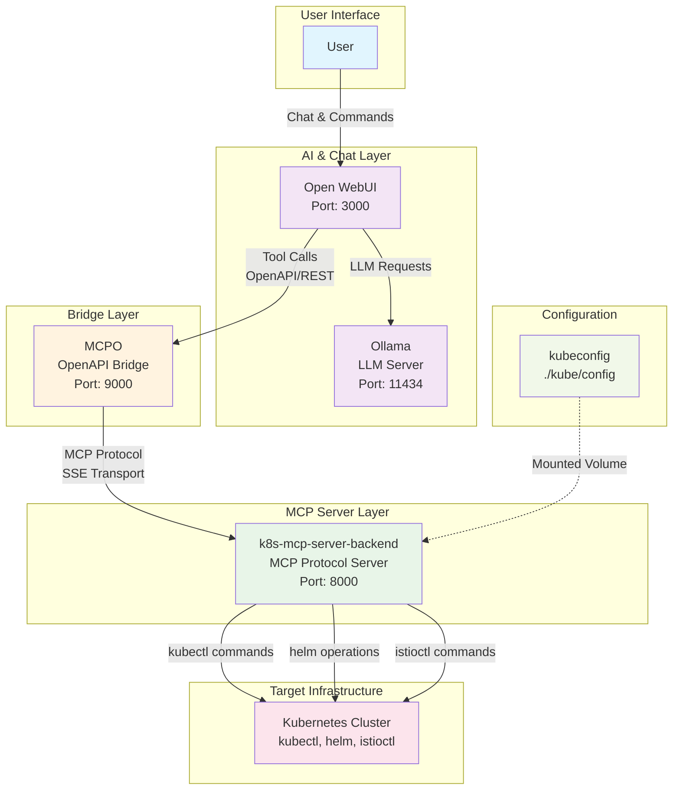
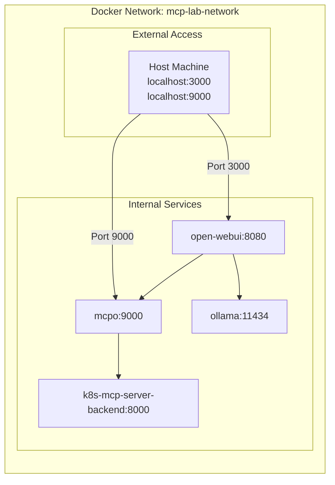

# Open WebUI Kubernetes Integration

## TL;DR

**Chat with your Kubernetes cluster using natural language!**

This project connects OpenWebUI to Kubernetes, letting you manage your cluster through conversational AI. Ask questions like "What pods are running?" or "Scale my deployment to 5 replicas" and get instant results.

### Quick Start

**One-command setup:**
```bash
./install.sh
```

**Componentes installed:**
- Kind (Kubernetes in Docker)
- Open Web UI
- Ollama
- k8s mcp Server
- MCP bridge 

**After successful installation, you'll see:**
✅ Docker Compose startup complete!

Services available at:
   - Open WebUI: <a href="http://localhost:3000">http://localhost:3000</A>
   - MCP Bridge: <a href="http://localhost:9000">http://localhost:9000</A>
   - Ollama API: <a href="http://localhost:11434">http://localhost:11434</A>

Configure Open WebUI to use the MCP tools

### Configure Open-WebUI

After running the installation script, you need to configure Open-WebUI to use the Kubernetes tools:

#### Step 1: Access Open-WebUI
1. Open your browser and go to **http://localhost:3000**
2. **Create an admin account** on first visit
3. **Sign in** with your new account

#### Step 2: Add the MCP Bridge Tool Server
1. Click on your **profile icon** (top right)
2. Go to **Settings**
3. Navigate to **Admin Panel** → **Tools**
4. Click **"+ Add Tool Server"**
5. Enter the following details:
   - **Name**: `Kubernetes Tools`
   - **URL**: `http://mcpo:9000`
   - **Description**: `Kubernetes management via kubectl and helm`
6. Click **"Add"**
---


---

#### Step 3: Add Connections to Models
Configure your AI model connections - use the local Ollama or add remote connections:

1. In **Settings**, go to **Admin Panel** → **Connections**
2. **For Local Ollama** (recommended):
   - The local Ollama server should be automatically detected
   - Verify connection to `http://ollama:11434`
3. **For Remote Connections** (optional):
   - Add OpenAI, Anthropic, or other model providers
   - Configure API keys and endpoints as needed


#### Step 4: Verify Tool Integration
1. Go back to the **chat interface**
2. Look for the **tools icon** (🔧) in the chat input area
3. You should see available tools like:
   - `kubectl_get` - List Kubernetes resources
   - `kubectl_apply` - Apply manifests
   - `kubectl_describe` - Describe resources
   - `helm_install` - Install Helm charts
   - And more...

#### Step 4: Test the Integration
Try asking these questions to verify everything works (copy and paste into the chat):

**Copy & Paste these queries:**

```
What pods are running in the kube-system namespace?
```

```
Show me all services in the default namespace
```

```
List all deployments across all namespaces
```

```
Create a new namespace called production
```

```
Install Jenkins using Helm in the jenkins namespace
```

#### Troubleshooting Configuration

**If tools don't appear:**
- Check that the MCP Bridge is running: `curl http://localhost:9000/health`
- Verify the tool server URL is exactly: `http://mcpo:9000`
- Restart Open-WebUI: `docker-compose restart open-webui`

**If you get connection errors:**
- Ensure all containers are running: `docker-compose ps`
- Check container logs: `docker-compose logs mcpo`
- Verify network connectivity between containers


**Then open http://localhost:3000 and start chatting with your cluster!**

**Example queries:**
- "What pods are running in kube-system?"
- "Show me all services in default namespace" 
- "Create a new namespace called production"
- "Install Jenkins using Helm in the jenkins namespace"

---

## Architecture Overview

This project integrates Open WebUI with Kubernetes management capabilities through a bridge architecture that connects multiple components to provide AI-powered Kubernetes operations.


## Architecture Diagram



## 📂 Repository Structure

```
openwebui-k8s-bridge/
├── mcp-bridge/          # Bridge service code
├── scripts/             # Setup and utility scripts
├── tests/               # Test scripts and examples
├── docs/                # Documentation
├── kube/               # Kubernetes configuration
├── k8s-mcp-server/     # MCP server implementation
├── docker-compose.yml  # Complete stack setup
└── README.md           # Main documentation
```

## Components

### 1. **Open WebUI**
- **Purpose**: Web-based chat interface for AI interactions
- **Port**: 3000
- **Role**: Provides the user interface and orchestrates AI conversations with tool calling capabilities
- **Key Features**:
  - Chat interface for natural language Kubernetes queries
  - Tool server integration for external API calls
  - Model management and conversation history

### 2. **Ollama**
- **Purpose**: Local LLM server
- **Port**: 11434
- **Role**: Provides the AI language model (llama3.2:latest) for understanding user queries and generating responses
- **Key Features**:
  - Local model hosting
  - Function calling capabilities
  - Integration with Open WebUI

### 3. **MCPO (MCP Bridge)**
- **Purpose**: Protocol bridge between OpenAPI and MCP
- **Port**: 9000
- **Role**: Translates REST API calls from Open WebUI into MCP protocol calls
- **Key Features**:
  - OpenAPI specification generation for Open WebUI
  - REST to MCP protocol translation
  - Tool parameter validation and formatting

### 4. **k8s-mcp-server-backend**
- **Purpose**: MCP server for Kubernetes operations
- **Port**: 8000 (internal)
- **Role**: Executes actual Kubernetes commands via kubectl, helm, and istioctl
- **Key Features**:
  - Multiple CLI tool support (kubectl, helm, istioctl, argocd)
  - MCP protocol implementation
  - Security modes and command validation
  - Cloud provider support (AWS EKS, GKE, AKS)

### 5. **Kubernetes Cluster**
- **Purpose**: Target infrastructure for management operations
- **Role**: The actual Kubernetes cluster being managed
- **Access**: Through kubeconfig mounted as volume

## Data Flow

1. **User Query**: User asks a Kubernetes-related question in Open WebUI
2. **AI Processing**: Ollama processes the query and determines if tools are needed
3. **Tool Selection**: Open WebUI identifies the appropriate kubectl_get tool
4. **API Call**: Open WebUI makes REST API call to MCPO bridge
5. **Protocol Translation**: MCPO translates REST call to MCP protocol
6. **Command Execution**: k8s-mcp-server-backend executes kubectl command
7. **Response Chain**: Results flow back through the same chain to the user

## Network Architecture



## Usage

Once configured, you can ask natural language questions about your Kubernetes cluster:

- "What pods are running in the kube-system namespace?"
- "Show me all services in the default namespace"
- "List all deployments across all namespaces"
- "Get the logs from the nginx pod"
- install argocd using helm from repo https://argoproj.github.io/argo-helm


The AI will automatically use the appropriate Kubernetes tools to execute commands and provide formatted responses.