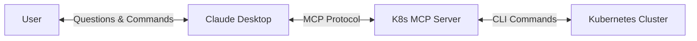
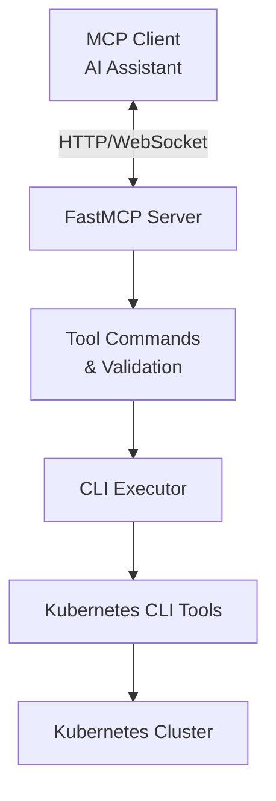
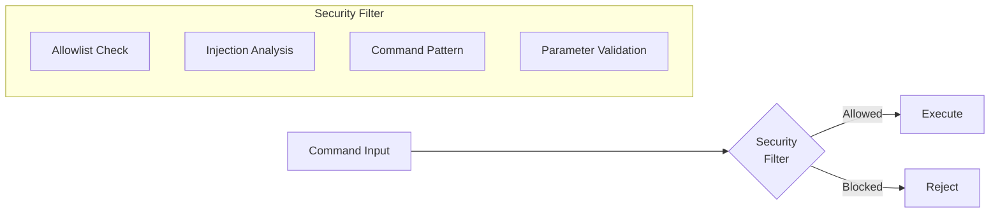
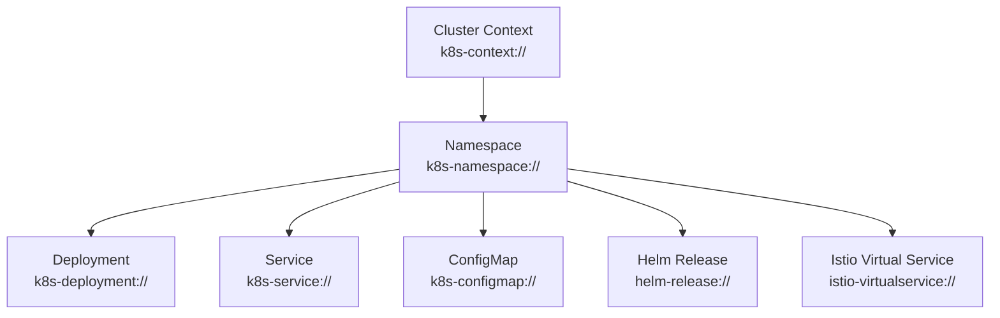
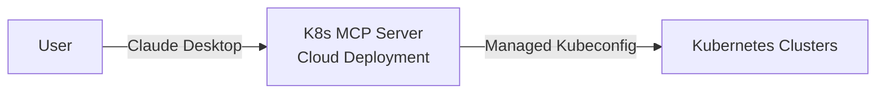
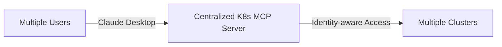

# Kubernetes MCP Server Architecture

This document describes the architecture, components, and security model of the K8s MCP Server.

## System Overview

The K8s MCP Server enables AI assistants like Claude to execute Kubernetes CLI tools through a secure, containerized environment:



The server acts as a bridge between AI assistants and Kubernetes infrastructure, allowing users to manage their clusters through natural language interactions.

## Component Architecture

The Kubernetes MCP Server consists of the following key components:



### Data Flow

1. The MCP Client (Claude) sends a request to the FastMCP Server
2. The FastMCP Server validates the request and routes it to the appropriate tool handler
3. The Tool Commands component validates the command against security policies
4. The CLI Executor runs the command securely and captures outputs
5. The Kubernetes CLI tools communicate with the Kubernetes cluster
6. Results flow back through the components to the MCP Client

## Component Responsibilities

### FastMCP Server
- Implements MCP protocol endpoints
- Handles tool requests and responses
- Manages client connections
- Registers prompt templates
- Handles MCP resources

### Tool Commands & Validation
- Processes documentation requests
- Processes execution requests
- Validates commands against security policies
- Validates parameters and formats responses
- Handles tool-specific logic (kubectl, helm, istioctl, argocd)

### CLI Executor
- Executes CLI commands securely
- Captures standard output and error streams
- Handles timeouts
- Injects context and namespace when appropriate
- Manages subprocess lifecycle

## Security Model

Security principles for the Kubernetes MCP Server include:

### Command Validation
- Allowlist-based approach for permitted commands
- Validation of all command inputs against injection attacks
- Pipe chain validation for authorized utilities only
- Specific validation for potentially dangerous commands like `kubectl exec`



### Execution Security
- Execution timeouts to prevent resource exhaustion
- Proper handling of command errors and timeouts
- Secure subprocess execution
- Non-root container user

### Authentication Security
- Basic detection of authentication errors
- Appropriate error messages for authentication issues
- No storage of sensitive credentials
- Read-only mount of credentials

## Error Handling Framework

A consistent error handling approach ensures clear communication:

### Error Categories
- Command validation errors
- Authentication errors
- Execution errors
- Timeout errors
- Internal system errors

### Standard Error Format
```typescript
type ErrorDetailsNested = {
  command?: string;
  exit_code?: number;
  stderr?: string;
};

type ErrorDetails = {
  message: string;
  code: string;
  details?: ErrorDetailsNested;
};

type CommandResult = {
  status: "success" | "error";
  output: string;
  exit_code?: number;
  execution_time?: number;
  error?: ErrorDetails;
};
```

### Common Error Messages
- Invalid tool: "Tool not found. Available tools: kubectl, helm, istioctl, argocd."
- Restricted command: "Command is restricted for security reasons."
- Context errors: "Context not found in kubeconfig. Available contexts: [list]."
- Timeout errors: "Command timed out after N seconds."

## Resource Management

The server implements the MCP resources pattern to provide persistent context for interactions:



Resources provide:
- Hierarchical context structure
- Persistent state across requests
- Dynamic updates and subscriptions
- Streamlined command operations

## Integration Patterns

The K8s MCP Server supports multiple integration patterns:

### Local Integration


### Remote Integration


### Enterprise Integration


## Configuration Principles

Configuration for the Kubernetes MCP Server follows these principles:

### Core Configuration Areas
- Server settings (host, port, logging)
- Tool settings (paths, allowed commands)
- Security settings (restrictions, allowed pipes)
- Timeout settings (default and maximum)
- Context and namespace settings

### Configuration Layering
- Default sensible configurations built-in
- Configuration overrides through environment variables
- Environment-specific settings

## Deployment Architecture

The K8s MCP Server is designed to be deployed as a Docker container, allowing for:

### Local Deployment
- Run alongside Claude Desktop on the user's machine
- Access to local Kubernetes configurations
- Integration with local cloud provider credentials

### Remote Deployment
- Run on a server or in a cloud environment
- Accessible to Claude via network
- Centralized management of configurations and security policies

## Performance Considerations

The server is designed with these performance characteristics:

- Lightweight container design
- Minimal resource requirements
- Fast command execution
- Efficient handling of command outputs
- Support for timeout configurations to prevent resource exhaustion