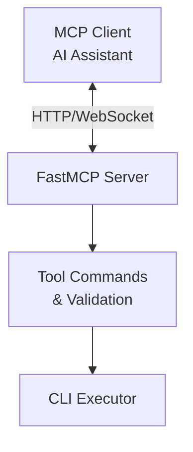

# Kubernetes MCP Server Specification

## Project Overview

The **Kubernetes MCP Server** provides a lightweight interface enabling AI assistants to execute Kubernetes CLI tools through the Model Context Protocol (MCP). This service bridges AI assistants like Claude Desktop with essential Kubernetes tooling (`kubectl`, `istioctl`, `helm`, `argocd`), allowing AI systems to help with Kubernetes deployments, configurations, troubleshooting, and optimization.

### Key Objectives

- **Command Documentation**: Provide detailed help information for Kubernetes CLI tools
- **Command Execution**: Execute commands for Kubernetes tools, returning raw results
- **MCP Compliance**: Fully implement the standard Model Context Protocol
- **Piped Commands**: Support Unix pipe operations to filter and transform command output
- **Secure Execution**: Execute commands with proper security measures
- **Tool Extensibility**: Maintain a design that easily accommodates new Kubernetes-related CLI tools
- **Consistent Output**: Preserve original tool output format for AI processing
- **Open Source**: Release under MIT license as a community resource

## Core Features

### 1. Tool-Specific Command Documentation

Each supported tool has a dedicated documentation function:

#### `describe_kubectl`
Retrieves help information for kubectl commands:

```json
{
  "name": "describe_kubectl",
  "description": "Get documentation and help text for kubectl commands",
  "parameters": {
    "command": {
      "type": "string",
      "description": "Specific command or subcommand to get help for (e.g., 'get pods')",
      "required": false
    }
  },
  "returns": {
    "help_text": "string",
    "status": "string",
    "error": "ErrorDetails | None"
  }
}
```

#### `describe_helm`
Retrieves help information for Helm commands.

#### `describe_istioctl`
Retrieves help information for Istio commands.

#### `describe_argocd`
Retrieves help information for ArgoCD commands.

**Example Usage:**
```
describe_kubectl({"command": "get pods"})
// Returns specific documentation for the kubectl get pods command
```

### 2. Tool-Specific Command Execution

Each supported tool has a dedicated execution function:

#### `execute_kubectl`
Executes kubectl commands:

```json
{
  "name": "execute_kubectl",
  "description": "Execute kubectl commands with support for Unix pipes",
  "parameters": {
    "command": {
      "type": "string",
      "description": "Complete kubectl command to execute (including any pipes and flags)",
      "required": true
    },
    "timeout": {
      "type": "integer",
      "description": "Maximum execution time in seconds (default: 300)",
      "required": false,
      "minimum": 1,
      "maximum": 1800
    }
  },
  "returns": {
    "status": "string",
    "output": "string",
    "exit_code": "integer (optional)",
    "execution_time": "number (optional)",
    "error": "ErrorDetails (optional)"
  }
}
```

#### `execute_helm`
Executes Helm commands.

#### `execute_istioctl`
Executes Istio commands.

#### `execute_argocd`
Executes ArgoCD commands.

**Example Usage:**
```
execute_kubectl({"command": "get pods -o json"})
// Returns JSON format output for pods

execute_helm({"command": "list", "timeout": 60})
// Lists all Helm releases with a 60-second timeout
```

### 3. AI-Driven Format Selection

The server relies on AI clients to specify output formats:

- AI clients are responsible for adding appropriate format flags (`-o json`, `-o yaml`, etc.)
- No automatic output format transformation by the server
- Raw command output is returned exactly as produced by the CLI tools
- AI clients can use pipe operators to process output as needed

**Examples:**
```
# JSON format for structured data processing
execute_kubectl({"command": "get pods -o json"})

# YAML format for configuration purposes
execute_kubectl({"command": "get deployment nginx -o yaml"})

# Wide output for human review
execute_kubectl({"command": "get pods -o wide"})
```

### 4. Context Management

The server provides capabilities for managing Kubernetes contexts:

- Support context switching through command parameters
- Clear error messages for authentication and context issues
- Support for multi-cluster environments
- Automatic context and namespace injection for kubectl and istioctl commands

**Examples:**
```
execute_kubectl({"command": "config use-context dev-cluster"})
// Switches to the dev-cluster context

execute_kubectl({"command": "config get-contexts"})
// Lists all available contexts

execute_kubectl({"command": "--context=prod-cluster get pods"})
// Runs the command against the prod-cluster without changing the default context
```

### 5. Command Piping

Support for Unix command piping enhances functionality:

- Standard Unix utilities can be piped with Kubernetes commands
- Common filtering tools are supported (`grep`, `awk`, `sed`, etc.)
- Data manipulation tools like `jq` and `yq` are available

**Supported Unix Commands:**
- Text processing: `grep`, `sed`, `awk`, `cut`, `sort`, `uniq`, `wc`, `head`, `tail`
- Data manipulation: `jq`, `yq`, `xargs`
- File operations: `ls`, `cat`, `find`
- And many other standard Unix utilities

**Examples:**
```
execute_kubectl({"command": "get pods -o json | jq '.items[].metadata.name'"})
// Extracts just the pod names from JSON output

execute_kubectl({"command": "get pods | grep Running | wc -l"})
// Counts the number of running pods
```

### 6. Tool Extension Approach

The server follows a standard pattern for adding new Kubernetes-related CLI tools:

- Consistent interface design across all supported tools
- Well-defined parameter patterns and return formats
- Standardized error handling

**Tool Configuration Principles:**
- Each tool must define its allowed commands
- Each tool provides its own documentation function
- Each tool provides its own execution function

### 7. Prompt Templates

The server provides a collection of prompt templates for common operations across Kubernetes, Istio, Helm, and ArgoCD. These templates guide AI interactions, leveraging attached resources and tools for efficient workflows, while maintaining the original intent of supporting common Kubernetes operations such as resource status checking, application deployment, troubleshooting, resource inventory, and security analysis.

#### Kubernetes Prompts

1. **Resource Status Check** (`K8s_resource_status`)
   - **Description**: Checks the status of specified Kubernetes resources.
   - **Parameters**: `resource_type`, `namespace`, `context`
   - **Steps**:
     1. Use attached `k8s-context` or `k8s-namespace` resources for defaults if available.
     2. Execute `kubectl get <resource_type>`.
     3. Return status summary.
   - **Use Case**: Monitoring pod health in the default namespace.
   - **Example Usage**:
     ```
     k8s_resource_status(resource_type="pods", namespace="default")
     // Generates a prompt to check pod status in the default namespace
     ```

2. **Deploy Application** (`k8s_deploy_application`)
   - **Description**: Deploys an application using a manifest or Helm chart.
   - **Parameters**: `manifest`, `chart`, `release_name`, `values`, `namespace`, `context`
   - **Steps**:
     1. Use attached resources for defaults (e.g., `k8s-namespace`).
     2. Execute `kubectl apply` or `helm install`.
     3. Monitor deployment status.
   - **Use Case**: Deploying a new microservice to a development cluster.

3. **Troubleshoot Resource** (`k8s_troubleshoot`)
   - **Description**: Troubleshoots issues with a Kubernetes resource.
   - **Parameters**: `resource_type`, `resource_name`, `namespace`, `context`
   - **Steps**:
     1. Use attached `k8s-deployment` or `k8s-namespace` resources.
     2. Run `kubectl describe` and `kubectl logs`.
     3. Analyze output for errors.
   - **Use Case**: Diagnosing a failing pod.

4. **Resource Inventory** (`k8s_resource_inventory`)
   - **Description**: Lists all resources in a cluster or namespace.
   - **Parameters**: `namespace`, `context`
   - **Steps**:
     1. Use attached `k8s-context` or `k8s-namespace`.
     2. Execute `kubectl get all`.
     3. Summarize resources.
   - **Use Case**: Auditing resources in a production cluster.

5. **Security Check** (`k8s_security_check`)
   - **Description**: Performs a security analysis of Kubernetes resources.
   - **Parameters**: `resource_type`, `namespace`, `context`
   - **Steps**:
     1. Use attached resources.
     2. Run `kubectl auth can-i` and check RBAC policies.
     3. Report vulnerabilities.
   - **Use Case**: Ensuring pod security compliance.

6. **Scale Resources** (`k8s_resource_scaling`)
   - **Description**: Scales a deployment to a specified number of replicas.
   - **Parameters**: `deployment_name`, `replicas`, `namespace`, `context`
   - **Steps**:
     1. Use attached `k8s-deployment` resource.
     2. Run `kubectl scale`.
     3. Confirm scaling.
   - **Use Case**: Increasing replicas during high traffic.

7. **Logs Analysis** (`k8s_logs_analysis`)
   - **Description**: Analyzes logs from Kubernetes resources.
   - **Parameters**: `resource_type`, `resource_name`, `namespace`, `context`
   - **Steps**:
     1. Use attached resources.
     2. Execute `kubectl logs`.
     3. Parse logs for key issues.
   - **Use Case**: Identifying application errors in logs.

#### Istio Prompts

1. **Manage Service Mesh** (`istio_service_mesh`)
   - **Description**: Manages Istio service mesh configurations.
   - **Parameters**: `service_name`, `namespace`, `context`
   - **Steps**:
     1. Use attached `k8s-namespace`.
     2. Run `istioctl analyze` or apply Virtual Services.
     3. Verify mesh status.
   - **Use Case**: Configuring traffic routing.

2. **Set Up Canary Deployment** (`istio_canary_setup`)
   - **Description**: Routes a percentage of traffic to a new service version.
   - **Parameters**: `service_name`, `new_version`, `canary_percentage`, `namespace`, `context`
   - **Steps**:
     1. Create canary deployment.
     2. Configure Istio Destination Rule and Virtual Service.
     3. Verify traffic splitting.
   - **Use Case**: Testing a new API version with minimal risk.

3. **Enable Mutual TLS** (`istio_mtls_enable`)
   - **Description**: Enforces mTLS for services in a namespace.
   - **Parameters**: `namespace`, `context`
   - **Steps**:
     1. Apply mTLS policy.
     2. Verify with `istioctl authn tls-check`.
   - **Use Case**: Securing internal service communication.

#### Helm Prompts

1. **Manage Charts** (`helm_chart_management`)
   - **Description**: Manages Helm charts and releases.
   - **Parameters**: `chart_name`, `release_name`, `namespace`, `context`
   - **Steps**:
     1. Use attached `helm-release` or `helm-chart`.
     2. Run `helm list` or `helm status`.
     3. Provide release details.
   - **Use Case**: Checking installed charts.

2. **Install Chart** (`helm_install_chart`)
   - **Description**: Installs a Helm chart with custom values.
   - **Parameters**: `chart_name`, `release_name`, `values`, `namespace`, `context`
   - **Steps**:
     1. Use attached `helm-chart` and `k8s-namespace`.
     2. Run `helm install`.
     3. Check release status.
   - **Use Case**: Deploying a database with specific configurations.

3. **Upgrade Chart** (`helm_upgrade_chart`)
   - **Description**: Upgrades an existing Helm release.
   - **Parameters**: `release_name`, `chart_name`, `values`, `namespace`, `context`
   - **Steps**:
     1. Use attached `helm-release`.
     2. Run `helm upgrade`.
     3. Verify upgrade history.
   - **Use Case**: Updating an application to a new chart version.

#### ArgoCD Prompts

1. **Manage Application** (`argocd_application`)
   - **Description**: Manages an ArgoCD application.
   - **Parameters**: `application_name`, `argocd_context`
   - **Steps**:
     1. Use attached `argocd-application`.
     2. Run `argocd app get`.
     3. Report application status.
   - **Use Case**: Checking application sync state.

2. **Sync Application** (`argocd_sync_application`)
   - **Description**: Syncs an ArgoCD application to the latest Git commit.
   - **Parameters**: `application_name`, `argocd_context`
   - **Steps**:
     1. Use attached `argocd-application`.
     2. Run `argocd app sync`.
     3. Check sync status.
   - **Use Case**: Deploying new features from Git.

3. **Rollback Application** (`argocd_rollback_application`)
   - **Description**: Rolls back an ArgoCD application to a previous version.
   - **Parameters**: `application_name`, `revision`, `argocd_context`
   - **Steps**:
     1. Use attached `argocd-application`.
     2. Run `argocd app rollback`.
     3. Verify rollback.
   - **Use Case**: Reverting a failed deployment.

#### Value of Prompts

- **Standardized Workflows**: Ensure consistent operations across tasks.
- **Context-Aware Operations**: Leverage attached resources for efficiency.
- **Guided Interactions**: Simplify complex workflows into step-by-step processes.
- **Enhanced Usability**: Make Kubernetes operations accessible to non-experts.

### 8. MCP Resources

The Kubernetes MCP Server leverages MCP resources to deliver a persistent, structured context for AI-driven interactions within Kubernetes, Istio, Helm, and ArgoCD environments. These resources encapsulate stable entities—such as clusters, namespaces, deployments, Helm releases, and ArgoCD applications—enabling AI assistants to maintain state, streamline operations, and provide context-aware guidance. By attaching resources to conversations, users can interact with their infrastructure more intuitively, reducing repetitive inputs and enhancing operational efficiency.

---

#### 8.1 Supported Resource Types

The server supports an extensive array of resource types tailored to Kubernetes, Istio, Helm, and ArgoCD, each with a unique URI scheme, detailed properties, and specific use cases. Below is a comprehensive breakdown of these resource types.

##### 8.1.1 Kubernetes Resources

1. **Cluster Contexts** (`k8s-context://<context-name>`)
   - **Description**: Represents a Kubernetes cluster configuration derived from the user's kubeconfig.
   - **Properties**:
     - `name`: Context name (e.g., "prod-cluster").
     - `server`: API server URL (e.g., "https://api.prod-cluster.example.com").
     - `current_namespace`: Default namespace (optional, e.g., "default").
   - **Use Cases**:
     - Switching between multiple clusters in a multi-cluster setup.
     - Providing cluster-specific context for kubectl or API calls.
     - Verifying cluster connectivity and credentials.

2. **Namespaces** (`k8s-namespace://<context-name>/<namespace>`)
   - **Description**: Represents a namespace within a specific cluster context.
   - **Properties**:
     - `name`: Namespace name (e.g., "kube-system").
     - `context`: Parent cluster context (e.g., "prod-cluster").
     - `labels`: Metadata key-value pairs (e.g., "env=production").
     - `annotations`: Optional metadata (e.g., "owner=team-a").
   - **Use Cases**:
     - Scoping commands or queries to a namespace.
     - Analyzing resource quotas or RBAC configurations.
     - Setting a default operational scope.

3. **Deployments** (`k8s-deployment://<context-name>/<namespace>/<deployment>`)
   - **Description**: Represents a Kubernetes deployment within a namespace.
   - **Properties**:
     - `name`: Deployment name (e.g., "web-app").
     - `namespace`: Parent namespace (e.g., "default").
     - `context`: Parent cluster context (e.g., "prod-cluster").
     - `replicas`: Desired number of replicas (e.g., 3).
     - `status`: Current state (e.g., "Running", "Failed").
   - **Use Cases**:
     - Monitoring deployment health or scaling events.
     - Troubleshooting pod crashes or misconfigurations.
     - Adjusting resource requests/limits for optimization.

4. **Services** (`k8s-service://<context-name>/<namespace>/<service>`)
   - **Description**: Represents a Kubernetes service within a namespace.
   - **Properties**:
     - `name`: Service name (e.g., "frontend").
     - `namespace`: Parent namespace.
     - `context`: Parent cluster context.
     - `type`: Service type (e.g., "ClusterIP", "LoadBalancer").
     - `ports`: Exposed ports (e.g., "80:8080").
     - `selector`: Pod selection criteria (e.g., "app=frontend").
   - **Use Cases**:
     - Configuring Istio routing rules.
     - Exposing applications to internal or external traffic.

5. **ConfigMaps** (`k8s-configmap://<context-name>/<namespace>/<configmap>`)
   - **Description**: Represents a ConfigMap within a namespace.
   - **Properties**:
     - `name`: ConfigMap name (e.g., "app-config").
     - `namespace`: Parent namespace.
     - `context`: Parent cluster context.
     - `data`: Key-value pairs (e.g., "log_level=debug").
   - **Use Cases**:
     - Supplying environment-specific configurations.
     - Debugging configuration drift or errors.

##### 8.1.2 Istio Resources

1. **Gateways** (`istio-gateway://<context-name>/<namespace>/<gateway>`)
   - **Description**: Defines an entry point for external traffic into the Istio service mesh.
   - **Properties**:
     - `name`: Gateway name (e.g., "ingress-gateway").
     - `namespace`: Parent namespace.
     - `context`: Parent cluster context.
     - `servers`: Host, port, and protocol configs (e.g., "http:80").
     - `tls`: TLS settings (optional, e.g., "mode: SIMPLE").
   - **Use Cases**:
     - Setting up HTTPS ingress for secure access.
     - Integrating with external load balancers.

2. **Virtual Services** (`istio-virtualservice://<context-name>/<namespace>/<virtualservice>`)
   - **Description**: Specifies traffic routing rules within the Istio mesh.
   - **Properties**:
     - `name`: Virtual Service name (e.g., "app-routing").
     - `namespace`: Parent namespace.
     - `context`: Parent cluster context.
     - `hosts`: Target hosts (e.g., "app.example.com").
     - `gateways`: Associated gateways (optional).
     - `http`: Routing rules (e.g., "route: 80% v1, 20% v2").
   - **Use Cases**:
     - Implementing canary deployments.
     - Routing based on headers or user attributes.

3. **Destination Rules** (`istio-destinationrule://<context-name>/<namespace>/<destinationrule>`)
   - **Description**: Defines policies for traffic directed to a service.
   - **Properties**:
     - `name`: Destination Rule name (e.g., "app-policy").
     - `namespace`: Parent namespace.
     - `context`: Parent cluster context.
     - `host`: Target service (e.g., "app-svc").
     - `traffic_policy`: Load balancing or TLS settings.
     - `subsets`: Service versions (e.g., "v1", "v2").
   - **Use Cases**:
     - Splitting traffic for A/B testing or canaries.
     - Enforcing mutual TLS or connection pooling.

4. **Service Entries** (`istio-serviceentry://<context-name>/<namespace>/<serviceentry>`)
   - **Description**: Registers external services with the Istio mesh.
   - **Properties**:
     - `name`: Service Entry name (e.g., "external-api").
     - `namespace`: Parent namespace.
     - `context`: Parent cluster context.
     - `hosts`: External hostnames (e.g., "api.thirdparty.com").
     - `ports`: Exposed ports (e.g., "443").
     - `resolution`: Resolution method (e.g., "DNS").
   - **Use Cases**:
     - Integrating external APIs or databases.
     - Securing and monitoring egress traffic.

##### 8.1.3 Helm Resources

1. **Chart Repositories** (`helm-repo://<repo-name>`)
   - **Description**: Represents a Helm chart repository.
   - **Properties**:
     - `name`: Repository name (e.g., "stable").
     - `url`: Repository URL (e.g., "https://charts.helm.sh/stable").
     - `status`: Connection status (e.g., "active").
   - **Use Cases**:
     - Sourcing Helm charts for deployments.
     - Managing trusted chart repositories.

2. **Releases** (`helm-release://<context-name>/<namespace>/<release>`)
   - **Description**: Represents a deployed Helm release within a namespace.
   - **Properties**:
     - `name`: Release name (e.g., "wordpress").
     - `namespace`: Parent namespace.
     - `context`: Parent cluster context.
     - `chart`: Chart name and version (e.g., "wordpress-9.0.3").
     - `status`: Release status (e.g., "deployed").
     - `values`: Applied configuration values (e.g., "replicas: 2").
   - **Use Cases**:
     - Upgrading or rolling back releases.
     - Inspecting deployed chart configurations.

##### 8.1.4 ArgoCD Resources

1. **Applications** (`argocd-application://<argocd-instance>/<application>`)
   - **Description**: Represents an ArgoCD application managing GitOps deployments.
   - **Properties**:
     - `name`: Application name (e.g., "guestbook").
     - `argocd_instance`: ArgoCD instance ID (e.g., "argocd-prod").
     - `project`: Parent project (e.g., "default").
     - `source`: Git repo URL, path, revision (e.g., "main").
     - `destination`: Target cluster and namespace.
     - `sync_status`: Sync state (e.g., "Synced").
     - `health_status`: Health state (e.g., "Healthy").
   - **Use Cases**:
     - Syncing applications to Git-defined states.
     - Monitoring deployment health and drift.

2. **Projects** (`argocd-project://<argocd-instance>/<project>`)
   - **Description**: Groups ArgoCD applications with deployment policies.
   - **Properties**:
     - `name`: Project name (e.g., "prod").
     - `argocd_instance`: ArgoCD instance ID.
     - `destinations`: Allowed clusters/namespaces.
     - `source_repos`: Permitted Git repositories.
   - **Use Cases**:
     - Organizing apps by team or environment.
     - Enforcing deployment policies and restrictions.

3. **Repositories** (`argocd-repository://<argocd-instance>/<repo-url>`)
   - **Description**: Represents a Git repository registered with ArgoCD.
   - **Properties**:
     - `url`: Repository URL (e.g., "https://github.com/org/repo").
     - `argocd_instance`: ArgoCD instance ID.
     - `type`: Repository type (e.g., "git").
     - `connection_status`: Connectivity state (e.g., "connected").
   - **Use Cases**:
     - Managing Git sources for applications.
     - Validating repository access and credentials.

---

#### 8.2 Resource Hierarchy

Resources are structured hierarchically to mirror their natural relationships, facilitating intuitive navigation and context inheritance:

- **Cluster Context** (`k8s-context://<context-name>`)
  - **Namespace** (`k8s-namespace://<context-name>/<namespace>`)
    - **Deployment** (`k8s-deployment://<context-name>/<namespace>/<deployment>`)
    - **Service** (`k8s-service://<context-name>/<namespace>/<service>`)
    - **ConfigMap** (`k8s-configmap://<context-name>/<namespace>/<configmap>`)
    - **Helm Release** (`helm-release://<context-name>/<namespace>/<release>`)
    - **Istio Gateway** (`istio-gateway://<context-name>/<namespace>/<gateway>`)
    - **Istio Virtual Service** (`istio-virtualservice://<context-name>/<namespace>/<virtualservice>`)
    - **Istio Destination Rule** (`istio-destinationrule://<context-name>/<namespace>/<destinationrule>`)
    - **Istio Service Entry** (`istio-serviceentry://<context-name>/<namespace>/<serviceentry>`)
- **Helm Chart Repository** (`helm-repo://<repo-name>`) (standalone)
- **ArgoCD Application** (`argocd-application://<argocd-instance>/<application>`) (scoped to ArgoCD instance)
- **ArgoCD Project** (`argocd-project://<argocd-instance>/<project>`) (scoped to ArgoCD instance)
- **ArgoCD Repository** (`argocd-repository://<argocd-instance>/<repo-url>`) (scoped to ArgoCD instance)

This hierarchy ensures that child resources inherit context from their parents (e.g., a deployment automatically includes its namespace and cluster context), simplifying resource management and usage.

---

#### 8.3 Resource Templates

Resource templates provide a parameterized approach to resource URIs, enabling clients to dynamically generate specific resource identifiers. This is particularly valuable for interactive UIs or scenarios requiring user input.

##### 8.3.1 Defining Resource Templates

The server exposes available templates via the `resources/templates/list` MCP method, detailing each template's structure and parameters.

**Example Request:**
```json
{
  "jsonrpc": "2.0",
  "id": 1,
  "method": "resources/templates/list"
}
```

**Example Response:**
```json
{
  "jsonrpc": "2.0",
  "id": 1,
  "result": {
    "resourceTemplates": [
      {
        "uriTemplate": "k8s-deployment://{context}/{namespace}/{deployment}",
        "name": "Kubernetes Deployment",
        "description": "Access a deployment in a specific cluster and namespace",
        "mimeType": "application/json"
      },
      {
        "uriTemplate": "helm-release://{context}/{namespace}/{release}",
        "name": "Helm Release",
        "description": "Access a Helm release in a specific namespace",
        "mimeType": "application/json"
      }
    ]
  }
}
```

##### 8.3.2 Using Resource Templates

Clients populate template parameters with specific values to create actionable URIs. For example:
- Template: `k8s-deployment://{context}/{namespace}/{deployment}`
- Values: `context="prod-cluster"`, `namespace="default"`, `deployment="my-app"`
- Resulting URI: `k8s-deployment://prod-cluster/default/my-app`

This mechanism simplifies resource selection in tools like Claude Desktop, where users can input or select values via dropdowns or forms, generating precise URIs for attachment.

---

#### 8.4 Resource Updates

The server ensures clients stay updated with resource changes through two MCP-compliant mechanisms: list updates and subscriptions.

##### 8.4.1 List Updates

When the resource list changes (e.g., a new deployment is added or a namespace is deleted), the server broadcasts a `notifications/resources/list_changed` notification.

**Example Notification:**
```json
{
  "jsonrpc": "2.0",
  "method": "notifications/resources/list_changed"
}
```

Clients respond by calling `resources/list` to fetch the updated resource list, ensuring their view remains current.

##### 8.4.2 Subscriptions

Clients can subscribe to specific resources for real-time updates, ideal for monitoring dynamic entities like deployments or ArgoCD applications.

- **Subscribe Request:**
  ```json
  {
    "jsonrpc": "2.0",
    "id": 2,
    "method": "resources/subscribe",
    "params": {
      "uri": "k8s-deployment://prod-cluster/default/my-app"
    }
  }
  ```

- **Update Notification:**
  ```json
  {
    "jsonrpc": "2.0",
    "method": "notifications/resources/updated",
    "params": {
      "uri": "k8s-deployment://prod-cluster/default/my-app"
    }
  }
  ```

Upon receiving an update, clients can use `resources/read` to retrieve the latest resource data. For instance, a deployment's `status` changing from "Running" to "Failed" triggers a notification, prompting a refresh.

---

#### 8.5 Attaching Resources

Resources can be attached to conversations using MCP protocol methods, setting default contexts for prompts and commands. For example, attaching a `k8s-namespace://prod-cluster/default` resource scopes subsequent `kubectl` commands to the "default" namespace unless overridden.

- **Multiple Attachments**: Clients can attach multiple resources (e.g., a cluster context and a deployment), with prompts intelligently combining their contexts.
- **Context Inheritance**: Hierarchical resources inherit parent context, ensuring seamless operation (e.g., a deployment includes its namespace and cluster details).

---

#### 8.6 MCP Compliance

All resource functionalities align with the MCP protocol:
- **Resource Listing**: `resources/list` and `resources/templates/list` methods.
- **Resource Reading**: `resources/read` returns JSON-formatted resource properties.
- **Subscriptions**: `resources/subscribe` and `notifications/resources/updated` for real-time updates.
- **List Changes**: `notifications/resources/list_changed` for list refreshes.

This compliance ensures interoperability with MCP clients, including Claude Desktop, supporting both manual and future automated resource interactions.

---

#### 8.7 Value for End Users

- **Persistent Context**: Maintains state across sessions, minimizing repetitive inputs.
- **Hierarchical Navigation**: Enables intuitive exploration from clusters to workloads.
- **Dynamic Updates**: Keeps users informed of changes in real time, aiding monitoring.
- **Simplified Operations**: Abstracts complex entities into manageable resources, lowering the barrier for Kubernetes management.

## Architecture

### Component Overview

The Kubernetes MCP Server consists of these logical components:



### Component Responsibilities

1. **FastMCP Server**
   - Implements MCP protocol endpoints
   - Handles tool requests and responses
   - Manages client connections
   - Registers prompt templates

2. **Tool Commands & Validation**
   - Processes documentation requests
   - Processes execution requests
   - Validates commands against security policies
   - Validates parameters and formats responses

3. **CLI Executor**
   - Executes CLI commands securely
   - Captures standard output and error streams
   - Handles timeouts
   - Injects context and namespace when appropriate

### Security Model

Security principles for the Kubernetes MCP Server include:

1. **Command Validation**
   - Allowlist-based approach for permitted commands
   - Validation of all command inputs against injection attacks
   - Pipe chain validation for authorized utilities only
   - Specific validation for potentially dangerous commands like `kubectl exec`

2. **Execution Security**
   - Execution timeouts to prevent resource exhaustion
   - Proper handling of command errors and timeouts
   - Secure subprocess execution

3. **Authentication Security**
   - Basic detection of authentication errors
   - Appropriate error messages for authentication issues
   - No storage of sensitive credentials

### Error Handling Framework

A consistent error handling approach ensures clear communication:

1. **Error Categories**
   - Command validation errors
   - Authentication errors
   - Execution errors
   - Timeout errors
   - Internal system errors

2. **Standard Error Format**
   ```typescript
   type ErrorDetailsNested = {
     command?: string;
     exit_code?: number;
     stderr?: string;
   };

   type ErrorDetails = {
     message: string;
     code: string;
     details?: ErrorDetailsNested;
   };

   type CommandResult = {
     status: "success" | "error";
     output: string;
     exit_code?: number;
     execution_time?: number;
     error?: ErrorDetails;
   };
   ```

3. **Common Error Messages**
   - Invalid tool: "Tool not found. Available tools: kubectl, helm, istioctl, argocd."
   - Restricted command: "Command is restricted for security reasons."
   - Context errors: "Context not found in kubeconfig. Available contexts: [list]."
   - Timeout errors: "Command timed out after N seconds."

### Configuration Principles

Configuration for the Kubernetes MCP Server follows these principles:

1. **Core Configuration Areas**
   - Server settings (host, port, logging)
   - Tool settings (paths, allowed commands)
   - Security settings (restrictions, allowed pipes)
   - Timeout settings (default and maximum)
   - Context and namespace settings

2. **Configuration Layering**
   - Default sensible configurations built-in
   - Configuration overrides through environment variables
   - Environment-specific settings

## Conclusion

This Kubernetes MCP Server specification outlines a focused approach to providing Kubernetes CLI capabilities to AI assistants through the Model Context Protocol. By emphasizing clean interfaces, security, and flexibility, the specification supports a system that can serve as a bridge between AI assistants and Kubernetes environments.

The design prioritizes tool-specific commands rather than generic interfaces, enabling clearer usage patterns and more robust parameter validation. The security model focuses on principles rather than implementation details, allowing for various secure implementations. The error handling framework ensures consistent and clear communication of issues to clients.

Additional features like automatic context/namespace injection, enhanced prompt templates, and MCP resources enhance the usability and value of the server for AI assistant interactions with Kubernetes environments, providing persistent context and guided workflows for efficient operations.